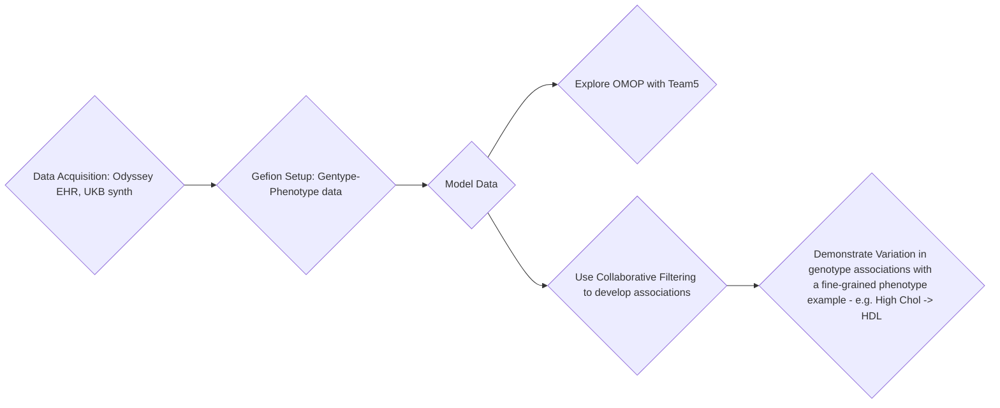

# Metametagraphs
Nordic Conference on Future Health 2026 (14–16 September 2026)

## Team 8: Rapid accretion of phenotype-genotype metagraphs from varied datasets

* Victor Enrique Goitea
* Chris Hart
* Davor Vukadin
* Henrik Formoe
* Edvin Smajlovic
* Sebastian Krog [writer]
* Elakiya Sivakumar

## Simplified usecase

In a federated environment, given one or more genotype-phenotype maps, and one or more sets of electronic health record data,
does querried subhierachy phenotype differences within EHRs show variation in genotype associations?

## Milestones
1. Modelled data examples.
2. Acquire larger (synthetic?) data access.
3. Up and running on Gefion.
4. Data cleaning ready for collaborative filtering.
5. Model that extracts information from EHRs to enrich phenotype definitions
   - Decide on which EHR data types (e.g. ICD10 codes)
   - Define subphenotypes (phenotype ontologies, ICD10 etc.)
6. Display dissimilar genotypes for a given phenotype or set of subphenotypes
7. Simple interface to query phenotype or subtypes

## Useful datasets
Odyssey consortion EHR data
UK biobank synthetic genotype-phenotype map data

## Flowchart




## Step 1

Minimal example of collaborative filtering on gene x phenotypes.

For this, we propose to use genebass. https://app.genebass.org

## Federated collaborative filtering (NVFLARE)

Each site has a binary `N × P` patient–phenotype matrix (1 = diagnosis present)
and may also have a continuous `G × P` PRS / genome–phenotype matrix. Sites train
a reconstruction loss against **shared** `P × 32` phenotype embeddings; patient
and genome vectors stay local. NVFLARE FedAverages those tables and L2-normalizes
each phenotype vector.

- genome-less embeddings from `N × P` (binary reconstruction)
- genome-based embeddings from `G × P` (only sites that have genetic data)

```bash
python scripts/run_federated_cf_job.py
```

Outputs `data/federated/global_phenotype_embeddings.npz` with
`nongenetic_phenotype_embeddings` and `genetic_phenotype_embeddings`.
