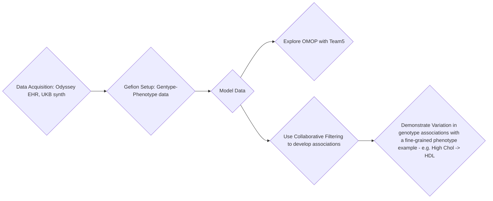

# F3CF: A Flexible Federated Framework for Multi-Relational Collaborative Factorization
Nordic Conference on Future Health 2026 (14–16 September 2026)

## DEMO

Insert demo here.

## Simplified usecase

In a federated environment, given one or more genotype-phenotype maps, and one or more sets of electronic health record data,
does querried subhierachy phenotype differences within EHRs show variation in genotype associations?

## Milestones
1. Modelled data examples.
2. Acquire larger (synthetic?) data access.
3. Up and running on Gefion.
4. Data cleaning ready for collaborative filtering.
5. Model that extracts information from EHRs to enrich phenotype definitions
   - Decide on which EHR data types (e.g. ICD10 codes)
   - Define subphenotypes (phenotype ontologies, ICD10 etc.)
6. Display dissimilar genotypes for a given phenotype or set of subphenotypes
7. Simple interface to query phenotype or subtypes

## Useful datasets
Odyssey consortion EHR data
UK biobank synthetic genotype-phenotype map data

## Infographs

Choose one of:
- [Infograph 1](images/infograph1.png)
- [Infograph 2](images/infograph2.png)
- [Infograph 3](images/infograph3.png)
- [Infograph 4](images/infograph4.png)

## Flowchart

## Step 1
Phenotypes x PRS (Genetic libality), Phenotypes x patient, Drug x patient

## Team 8: Rapid accretion of phenotype-genotype metagraphs from varied datasets
* Victor Enrique Goitea
* Chris Hart
* Davor Vukadin
* Henrik Formoe
* Edvin Smajlovic
* Sebastian Krog [writer]
* Elakiya Sivakumar

## Step X

Use this on real data.
