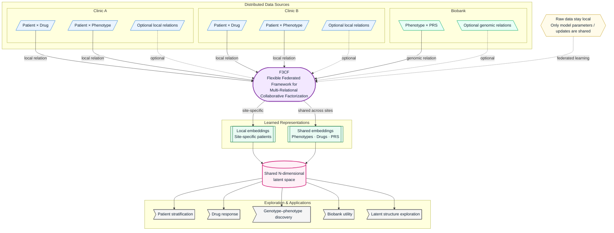

# F3CF: A Flexible Federated Framework for Multi-Relational Collaborative Factorization
F3CF is a framework for federated exploration of a shared multi-relational, multi-institutional latent knowledge space.
Nordic Conference on Future Health 2026 (14–16 September 2026).

## DEMO

Insert demo here.

## Mission

## Infographs

Choose one of:
- [Infograph 1](images/infograph1.png)
- [Infograph 2](images/infograph2.png)
- [Infograph 3](images/infograph3.png)
- [Infograph 4](images/infograph4.png)

## Milestones

## Flowchart
This version forces the institutions into a top row, left to right, with F3CF underneath.

## How it works

F3CF represents distributed clinical and biobank data as a set of related matrices, such as patient–drug, patient–phenotype, and phenotype–genotype (e.g. by PRS) relationships. Each site trains locally on the relations it holds, while shared entity representations are updated collaboratively across sites.

The framework learns a common N-dimensional latent space in which patients, phenotypes, drugs, PRS, and other entities can be compared and clustered. Patient-level representations can remain site-specific, while shared entities such as phenotypes or drugs are aligned across institutions.

Because the model is relational and modular, new clinics, entities, columns, or relation types can be added without redesigning the entire system. Raw data remain local; only model parameters or updates are exchanged during federated training.

The resulting latent space can then be explored for tasks such as patient stratification, drug-response prediction, genotype–phenotype discovery, and estimating whether external biobank data add useful information to a specific clinic.

Each data source is represented as a relation matrix, for example patient–drug, patient–phenotype, or phenotype–PRS.

F3CF learns low-dimensional embeddings such that:

$$
R^{(r)} \approx Z_a W_r Z_b^\top
$$

where \(Z_a\) and \(Z_b\) are latent representations of the connected entities, and \(W_r\) captures relation-specific structure.

The model jointly optimizes all available relations, sharing common embeddings across sites while keeping site-specific patient representations local.

## Exploring the latent space

There are several ways to explore the shared latent space:

- Patient-centric exploration — find nearest patients, phenotypes, PRS profiles, and candidate drugs.
- Phenotype-centric exploration — inspect which patients, genetic-risk profiles, and drugs cluster around a phenotype.
- Drug-centric exploration — identify phenotypic or genetic subgroups associated with a drug or drug response.
- Population-level exploration — cluster patients into latent subgroups and compare those groups by phenotype burden, PRS, treatment, and outcomes.

## Explore datasource relationships

Treat each datasource as a set of observations that contributes to the shared latent space, then measure its effect indirectly.

For a datasource \(D_k\), you can examine:

$$
\Delta Z_k = Z_{\text{all}} - Z_{\text{without }k}
$$

That is: how much does the learned latent space change when source \(k\) is removed?

Similarly, for a target clinic \(C\), define source utility as:

$$
U(D_k \rightarrow C) =
\text{Performance}(C + D_k) -
\text{Performance}(C)
$$

This tells you whether that source adds useful information to the clinic, without ever assigning the source its own embedding.

You could also compare sources through the entities they influence. For example:

$$
\text{Source A}
\rightarrow
\{\text{phenotype embeddings it constrains}\}
$$

versus

$$
\text{Source B}
\rightarrow
\{\text{phenotype embeddings it constrains}\}
$$

and measure overlap, complementarity, or directional influence between those sets.

## Future aspects

Rather than limiting F3CF to classical matrix factorization, allow the relation operator \(W_r\) to be modular. It could be a matrix factorization operator, knowledge-graph embedding such as a bilinear relation, or potentially a graph-neural-network component. That would make the “Flexible” part of F3CF substantially more meaningful: different relations could have different mathematical models while still contributing to the same shared representation.

## Team 8: Rapid accretion of phenotype-genotype metagraphs from varied datasets
* Victor Enrique Goitea
* Chris Hart
* Davor Vukadin
* Henrik Formoe
* Edvin Smajlovic
* Sebastian Krog [writer]
* Elakiya Sivakumar
