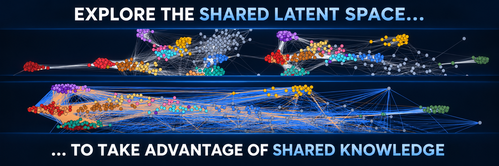
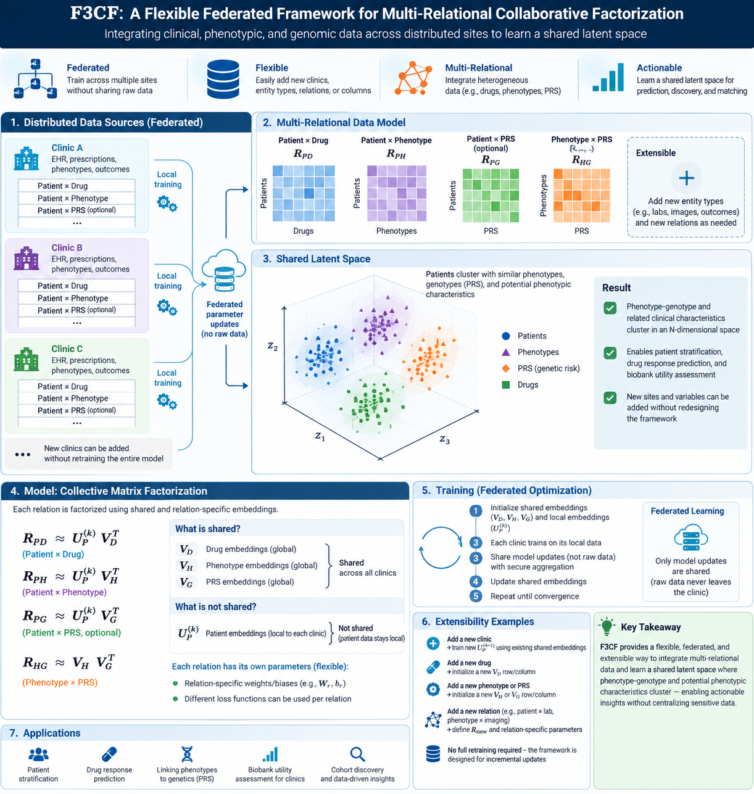

# F3CF: A Flexible Federated Framework for Multi-Relational Collaborative Factorization

**F3CF** (pronounced **“FREEZ-eff”**) is a framework for federated exploration of a shared, multi-relational, multi-institutional latent knowledge space.

The central idea is to let clinics, biobanks, and other data sources contribute relational information to shared entity representations without requiring patient-level data to leave the originating institution.

## Demo



The current proof-of-concept can be run locally using the NVIDIA FLARE simulator.

### Installation

```bash
git clone https://github.com/collaborativebioinformatics/Metametagraphs.git
cd Metametagraphs

python -m venv .venv
source .venv/bin/activate

pip install -r requirements.txt
```

The core requirements are PyTorch, NumPy, and NVIDIA FLARE.

### Run the basic federated demo

```bash
python scripts/run_federated_cf_job.py
```

By default, this:

1. generates a small synthetic multi-site dataset under `data/federated/`;
2. starts a local NVIDIA FLARE simulation;
3. performs local collaborative-factorization training at each site;
4. aggregates shared phenotype representations over federated rounds; and
5. writes the global phenotype embeddings to:

```text
data/federated/global_phenotype_embeddings.npz
```

Patient-level row representations remain local to each simulated site.

## Aim
F3CF aims to make distributed clinical, genomic, and biobank data jointly explorable while preserving the local control of patient-level information.

The framework is designed around three principles:

- **Federated:** patient-level data remain at the originating institution.
- **Multi-relational:** different relations can contribute to a common representation.
- **Flexible:** new sites, entities, relation types, and modelling components can be added over time.

## Infographic


## Flowchart


## How it works

F3CF represents distributed clinical and biobank data as a set of related matrices, such as patient–drug, patient–phenotype, and phenotype–genotype (e.g., PRS) relationships. Each site trains locally on the relations it holds, while shared entity representations are updated collaboratively across sites.

The framework learns a common N-dimensional latent space in which patients, phenotypes, drugs, PRS, and other entities can be compared and clustered. Patient-level representations can remain site-specific, while shared entities such as phenotypes and drugs are aligned across institutions.

Because the model is relational and modular, new clinics, entities, columns, or relation types can be added without redesigning the entire system. Raw data remain local; only model parameters or updates are exchanged during federated training.

The resulting latent space can be explored for tasks such as patient stratification, drug-response prediction, genotype–phenotype discovery, and estimating whether external biobank data add useful information to a specific clinic.

Each data source is represented as a relation matrix, for example patient–drug, patient–phenotype, or phenotype–PRS.

F3CF learns low-dimensional embeddings such that:

$$
R^{(r)} \approx Z_a W_r Z_b^\top
$$

where $Z_a$ and $Z_b$ are latent representations of the connected entities, and $W_r$ captures relation-specific structure.

The model jointly optimizes all available relations, sharing common embeddings across sites while keeping site-specific patient representations local.

## Implemented pipelines

Currently implemented pipelines include:

- Synthetic clinical and PRS data generation
- Site-formatted patient–phenotype and genomic-summary relations
- Federated collaborative factorization with NVIDIA FLARE

Experimental or planned pipelines include:

- Gene–phenotype collaborative filtering analysis pipeline
- Allowing patient-level covariates (age, sex)
- Additional biomedical relations such as drug × patient, phenotype x omics, or phenotype ontology edges
- Source-ablation analyses for estimating the utility of external datasets

See [PIPELINES.md](PIPELINES.md) for implementation details.

### Required pipelines for implementation
F3CF assumes that each participating site first converts its local source data into a common site format.

Before F3CF, site-specific pipelines are responsible for:

* extracting and harmonizing local clinical and genomic data;
* deriving phenotype features and genomic summary features;
* mapping features to shared identifiers; and
* exporting standardized relation matrices, such as `patient × phenotype` and `genomic-summary × phenotype`.

F3CF then performs federated collaborative factorization across the participating sites using NVIDIA FLARE.

Analysis pipelines will operate on the learned embeddings to support tasks such as:

* latent-space visualization and clustering;
* phenotype and genomic association exploration;
* held-out reconstruction or prediction;
* comparison with centralized or baseline models; and
* data-source utility and ablation analyses.

## Synthetic datasets

Synthetic data are used to test federation, feature-space heterogeneity, and known injected relationships before applying the framework to real clinical data.

## Exploring the latent space

F3CF is intended to support several levels of exploration.

- A local patient representation can be compared with the shared model without sharing that patient representation across sites.
- Phenotypes can be examined in relation to other variables and genomic-risk features.

Data source relationshipss can be explored as each source can be treated as a set of observations that contributes to the shared model. Its contribution can then be assessed indirectly by measuring how the learned structure or downstream performance changes when the source is added, removed, or perturbed.

For a data source $D_k$, its structural contribution can be measured by comparing models trained with and without that source:

$$
S(D_k) = d(Z_{all}, Z_{without\ D_k})
$$

where $d(\cdot,\cdot)$ is an alignment-aware measure of change in the latent structure, such as changes in pairwise similarities, nearest-neighbour structure, or clustering.

For a target clinic $C$, the utility of an external data source can be defined as:

$$
U(D_k \rightarrow C) = Performance(C \mid D_k) - Performance(C)
$$

This measures whether including information from $D_k$ improves performance on a defined task at clinic $C$.

## Results from the synthetic data

Results go here.

## Limitations

- **Latent associations are not necessarily clinically meaningful associations.** Proximity or strong relation scores require external validation and domain interpretation.
- **Patient-level representations are site-specific.** Direct alignment of patients across institutions is not guaranteed.
- **Dataset imbalance can affect the shared representation.** Large or dense sites may dominate optimization unless weighting or normalization is used.
- **Sparse relations can be weakly identified.** Entities with few observations may receive unstable representations.
- **The current prototype does not yet implement every relation shown in the conceptual framework.**
- **Federation does not eliminate privacy risk.** Shared updates or learned parameters may still require secure aggregation, access control, or additional privacy-preserving mechanisms in real deployments.

## Future aspects

F3CF should be tested on representative real-world datasets to determine whether the learned latent space provides clinically meaningful utility. This includes evaluating whether it recovers known biological relationships, improves prediction or stratification, and whether external data sources add measurable value to a clinical site. 

F3CF need not be limited to classical matrix factorization and the relation operator $W_r$ could be modular. It could be a matrix factorization operator, a knowledge-graph embedding such as a bilinear relation, or potentially a graph-neural-network component. Different relations could then use different mathematical models while still contributing to the same shared representation.

Relationships could also be extended using known relational graphs, ontologies, and other structured knowledge. For example, phenotype ontologies, gene–pathway relationships, drug–target interactions, and disease–gene associations could provide additional constraints on the latent space. This would allow F3CF to combine relationships learned from distributed data with established biological knowledge.

Such extensions will turn F3CF into a framework for exploring a federated **meta-knowledge graph**, where clinical observations, genomic associations, treatments, phenotypes, and existing biomedical knowledge contribute to a common latent representation. This could enable exploration of relationships that are not directly observed in any single dataset while preserving the distributed nature of the underlying data.

## Team 8 — Nordic Conference on Future Health 2026, 14–16 September 2026

https://docs.google.com/presentation/d/1Jp5w5cuf-wX1m194zMev2lda-B4DfVitLifrzrb_t6M/edit?usp=sharing

* Victor Enrique Goitea
* Davor Vukadin
* Henrik Formoe
* Edvin Smajlovic
* Sebastian Krog [writer]
* Elakiya Sivakumar
* Arvid Harder
