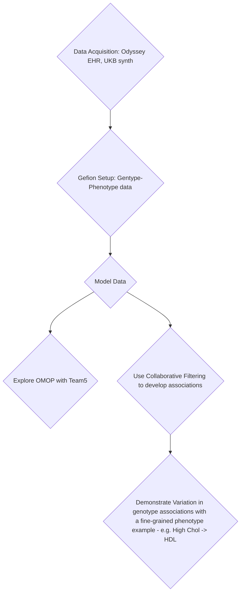

```mermaid
graph TD;
    A{"Data Acquisition: Odyssey EHR, UKB synth"}-->B{"Gefion Setup: Gentype-Phenotype data"};
    B-->C{"Model Data"};
    C-->D{"Explore OMOP with Team5"};
    C-->E{"Use Collaborative Filtering to develop associations"};
    E-->F{"Demonstrate Variation in genotype associations with a fine-grained phenotype example - e.g. High Chol -> HDL"};
```
